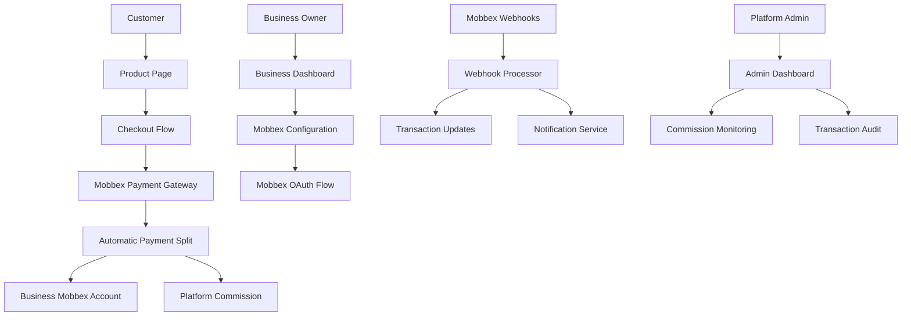

# Documento de Diseño - Integración Marketplace Mobbex

## Resumen

Este diseño transforma Lules Market de un modelo de ingresos basado en suscripciones a un modelo de marketplace basado en comisiones utilizando las capacidades de procesamiento de pagos de Mobbex Argentina. El sistema permitirá que los comercios conecten sus propias cuentas Mobbex, procesen pagos directamente, mientras la plataforma cobra automáticamente comisiones en cada transacción.

### Transformación del Modelo de Negocio

**Estado Actual:**
- Los comercios pagan suscripciones mensuales (Gratis: $0, Básico: $9.99, Premium: $29.99)
- La plataforma procesa pagos a través de cuenta centralizada de MercadoPago
- Ingresos de tarifas fijas de suscripción

**Estado Objetivo:**
- Los comercios conectan sus propias cuentas de pago Mobbex
- La plataforma cobra comisiones basadas en porcentajes de transacciones
- Los ingresos escalan con el volumen de transacciones del marketplace
- Los comercios mantienen relaciones directas de pago con clientes

## Arquitectura

### Diseño de Sistema de Alto Nivel



### Componentes Principales

1. **Servicio de Integración Mobbex**: Maneja la comunicación API con Mobbex
2. **Motor de Comisiones**: Calcula y procesa las tarifas de la plataforma
3. **Servicio de Procesamiento de Pagos**: Orquesta los flujos de transacciones
4. **Manejador de Webhooks**: Procesa las notificaciones de pago de Mobbex
5. **Servicio de Gestión de Cuentas**: Gestiona las conexiones de cuentas Mobbex de comercios
6. **Servicio de Auditoría**: Rastrea todas las transacciones y cálculos de comisión

## Components and Interfaces

### 1. Mobbex Integration Service

**Purpose**: Central service for all Mobbex API interactions

**Key Methods:**
```typescript
interface MobbexIntegrationService {
  // Account Management
  initiateAccountConnection(businessId: string): Promise<OAuthUrl>
  completeAccountConnection(businessId: string, authCode: string): Promise<MobbexAccount>
  validateAccountStatus(mobbexAccountId: string): Promise<AccountStatus>
  
  // Payment Processing
  createPaymentIntent(paymentRequest: PaymentRequest): Promise<PaymentIntent>
  processPaymentSplit(transactionId: string, splitConfig: SplitConfiguration): Promise<SplitResult>
  
  // Configuration Management
  syncPaymentMethods(mobbexAccountId: string): Promise<PaymentMethod[]>
  updateInstallmentSettings(mobbexAccountId: string, settings: InstallmentConfig): Promise<void>
}
```

### 2. Commission Engine

**Purpose**: Handles all commission calculations and processing

**Key Methods:**
```typescript
interface CommissionEngine {
  calculateCommission(amount: number, businessTier: SubscriptionTier): CommissionCalculation
  processCommissionSplit(transactionId: string): Promise<CommissionResult>
  getCommissionRates(): Promise<CommissionRates>
  updateCommissionRates(rates: CommissionRates): Promise<void>
}

interface CommissionCalculation {
  originalAmount: number
  commissionRate: number
  commissionAmount: number
  businessAmount: number
  platformAmount: number
}
```

### 3. Payment Processing Service

**Purpose**: Orchestrates the complete payment flow

**Key Methods:**
```typescript
interface PaymentProcessingService {
  initiateCheckout(productId: string, customerId: string): Promise<CheckoutSession>
  processPayment(paymentData: PaymentData): Promise<PaymentResult>
  handlePaymentSuccess(transactionId: string): Promise<void>
  handlePaymentFailure(transactionId: string, error: PaymentError): Promise<void>
}
```

### 4. Webhook Handler

**Purpose**: Processes real-time notifications from Mobbex

**Key Methods:**
```typescript
interface WebhookHandler {
  processPaymentWebhook(webhookData: MobbexWebhookData): Promise<void>
  validateWebhookSignature(payload: string, signature: string): boolean
  handleWebhookRetry(webhookId: string): Promise<void>
}
```

## Data Models

### Database Schema Changes

#### New Tables

```sql
-- Mobbex account credentials and configuration
CREATE TABLE mobbex_accounts (
  id UUID PRIMARY KEY DEFAULT gen_random_uuid(),
  business_id UUID NOT NULL REFERENCES businesses(id),
  mobbex_merchant_id VARCHAR(255) NOT NULL,
  access_token TEXT NOT NULL, -- Encrypted
  refresh_token TEXT, -- Encrypted
  account_status VARCHAR(50) NOT NULL DEFAULT 'pending',
  configuration JSONB,
  connected_at TIMESTAMP WITH TIME ZONE,
  last_sync_at TIMESTAMP WITH TIME ZONE,
  created_at TIMESTAMP WITH TIME ZONE DEFAULT NOW(),
  updated_at TIMESTAMP WITH TIME ZONE DEFAULT NOW(),
  
  UNIQUE(business_id),
  UNIQUE(mobbex_merchant_id)
);

-- Transaction records with commission tracking
CREATE TABLE marketplace_transactions (
  id UUID PRIMARY KEY DEFAULT gen_random_uuid(),
  business_id UUID NOT NULL REFERENCES businesses(id),
  customer_id UUID REFERENCES users(id),
  product_id UUID NOT NULL REFERENCES products(id),
  mobbex_transaction_id VARCHAR(255) NOT NULL,
  
  -- Amount breakdown
  total_amount DECIMAL(10,2) NOT NULL,
  commission_rate DECIMAL(5,4) NOT NULL,
  commission_amount DECIMAL(10,2) NOT NULL,
  business_amount DECIMAL(10,2) NOT NULL,
  
  -- Status tracking
  payment_status VARCHAR(50) NOT NULL DEFAULT 'pending',
  commission_status VARCHAR(50) NOT NULL DEFAULT 'pending',
  
  -- Metadata
  payment_method VARCHAR(100),
  installments INTEGER DEFAULT 1,
  mobbex_data JSONB,
  
  created_at TIMESTAMP WITH TIME ZONE DEFAULT NOW(),
  updated_at TIMESTAMP WITH TIME ZONE DEFAULT NOW(),
  
  UNIQUE(mobbex_transaction_id)
);

-- Commission rate configuration
CREATE TABLE commission_rates (
  id UUID PRIMARY KEY DEFAULT gen_random_uuid(),
  subscription_tier VARCHAR(50) NOT NULL,
  commission_rate DECIMAL(5,4) NOT NULL,
  effective_from TIMESTAMP WITH TIME ZONE NOT NULL,
  effective_until TIMESTAMP WITH TIME ZONE,
  created_by UUID REFERENCES users(id),
  created_at TIMESTAMP WITH TIME ZONE DEFAULT NOW(),
  
  UNIQUE(subscription_tier, effective_from)
);

-- Audit trail for all marketplace operations
CREATE TABLE marketplace_audit_log (
  id UUID PRIMARY KEY DEFAULT gen_random_uuid(),
  entity_type VARCHAR(50) NOT NULL,
  entity_id UUID NOT NULL,
  action VARCHAR(100) NOT NULL,
  old_data JSONB,
  new_data JSONB,
  user_id UUID REFERENCES users(id),
  ip_address INET,
  user_agent TEXT,
  created_at TIMESTAMP WITH TIME ZONE DEFAULT NOW()
);
```

#### Modified Tables

```sql
-- Add marketplace fields to businesses table
ALTER TABLE businesses ADD COLUMN mobbex_account_id UUID REFERENCES mobbex_accounts(id);
ALTER TABLE businesses ADD COLUMN marketplace_enabled BOOLEAN DEFAULT FALSE;
ALTER TABLE businesses ADD COLUMN commission_tier VARCHAR(50) DEFAULT 'standard';

-- Add marketplace fields to products table  
ALTER TABLE products ADD COLUMN marketplace_enabled BOOLEAN DEFAULT TRUE;
ALTER TABLE products ADD COLUMN commission_override DECIMAL(5,4);
```

### TypeScript Interfaces

```typescript
interface MobbexAccount {
  id: string
  businessId: string
  mobbexMerchantId: string
  accountStatus: 'pending' | 'active' | 'suspended' | 'disconnected'
  configuration: MobbexConfiguration
  connectedAt?: Date
  lastSyncAt?: Date
}

interface MobbexConfiguration {
  paymentMethods: PaymentMethod[]
  installmentOptions: InstallmentOption[]
  webhookUrl: string
  returnUrl: string
  cancelUrl: string
}

interface MarketplaceTransaction {
  id: string
  businessId: string
  customerId?: string
  productId: string
  mobbexTransactionId: string
  totalAmount: number
  commissionRate: number
  commissionAmount: number
  businessAmount: number
  paymentStatus: PaymentStatus
  commissionStatus: CommissionStatus
  paymentMethod?: string
  installments: number
  mobbexData: Record<string, any>
}

interface CommissionRates {
  free: number      // 5% commission for free tier
  basic: number     // 3% commission for basic tier  
  premium: number   // 2% commission for premium tier
}
```

## Error Handling

### 1. Account Connection Errors

**Scenarios:**
- Mobbex OAuth authorization fails
- Invalid or expired credentials
- Account verification issues

**Handling:**
```typescript
class AccountConnectionError extends Error {
  constructor(
    public code: 'OAUTH_FAILED' | 'INVALID_CREDENTIALS' | 'VERIFICATION_FAILED',
    public details: string,
    public retryable: boolean = false
  ) {
    super(details)
  }
}

// Retry logic with exponential backoff
async function retryAccountConnection(businessId: string, maxRetries: number = 3) {
  for (let attempt = 1; attempt <= maxRetries; attempt++) {
    try {
      return await connectMobbexAccount(businessId)
    } catch (error) {
      if (!error.retryable || attempt === maxRetries) {
        throw error
      }
      await delay(Math.pow(2, attempt) * 1000) // Exponential backoff
    }
  }
}
```

### 2. Payment Processing Errors

**Scenarios:**
- Mobbex API unavailable
- Insufficient funds
- Invalid payment data
- Commission calculation failures

**Handling:**
```typescript
class PaymentProcessingError extends Error {
  constructor(
    public code: 'API_UNAVAILABLE' | 'INSUFFICIENT_FUNDS' | 'INVALID_DATA' | 'COMMISSION_ERROR',
    public transactionId: string,
    public recoverable: boolean = false
  ) {
    super(`Payment processing failed: ${code}`)
  }
}

// Circuit breaker pattern for Mobbex API
class MobbexCircuitBreaker {
  private failures = 0
  private lastFailureTime = 0
  private readonly threshold = 5
  private readonly timeout = 60000 // 1 minute

  async execute<T>(operation: () => Promise<T>): Promise<T> {
    if (this.isOpen()) {
      throw new Error('Circuit breaker is open')
    }

    try {
      const result = await operation()
      this.onSuccess()
      return result
    } catch (error) {
      this.onFailure()
      throw error
    }
  }

  private isOpen(): boolean {
    return this.failures >= this.threshold && 
           (Date.now() - this.lastFailureTime) < this.timeout
  }
}
```

### 3. Webhook Processing Errors

**Scenarios:**
- Duplicate webhook delivery
- Invalid webhook signature
- Processing timeout
- Database transaction failures

**Handling:**
```typescript
// Idempotency handling
class WebhookProcessor {
  private processedWebhooks = new Set<string>()

  async processWebhook(webhookData: MobbexWebhookData): Promise<void> {
    const webhookId = webhookData.id
    
    if (this.processedWebhooks.has(webhookId)) {
      console.log(`Webhook ${webhookId} already processed, skipping`)
      return
    }

    try {
      await this.validateSignature(webhookData)
      await this.processTransaction(webhookData)
      this.processedWebhooks.add(webhookId)
    } catch (error) {
      await this.handleWebhookError(webhookId, error)
      throw error
    }
  }
}
```

## Testing Strategy

### 1. Unit Testing

**Focus Areas:**
- Commission calculation accuracy
- Payment split logic
- Webhook signature validation
- Error handling scenarios

**Example Test:**
```typescript
describe('CommissionEngine', () => {
  it('should calculate correct commission for premium tier', () => {
    const engine = new CommissionEngine()
    const result = engine.calculateCommission(1000, 'premium')
    
    expect(result.commissionRate).toBe(0.02) // 2%
    expect(result.commissionAmount).toBe(20)
    expect(result.businessAmount).toBe(980)
  })
})
```

### 2. Integration Testing

**Focus Areas:**
- Mobbex API integration
- Database transaction integrity
- Webhook end-to-end flow
- Payment processing pipeline

**Test Environment:**
- Mobbex sandbox environment
- Test database with sample data
- Mock webhook delivery system

### 3. End-to-End Testing

**Scenarios:**
- Complete customer purchase flow
- Business account connection process
- Commission processing and reconciliation
- Error recovery and retry mechanisms

### 4. Performance Testing

**Metrics:**
- Payment processing latency
- Webhook processing throughput
- Database query performance
- API response times

**Load Testing:**
- Concurrent payment processing
- High-volume webhook delivery
- Commission calculation under load

### 5. Security Testing

**Areas:**
- Credential encryption/decryption
- Webhook signature validation
- API authentication
- Data access controls

## Migration Strategy

### Phase 1: Infrastructure Setup
1. Deploy new database tables
2. Implement Mobbex integration services
3. Create business onboarding flow
4. Set up webhook endpoints

### Phase 2: Pilot Program
1. Select subset of businesses for beta testing
2. Migrate pilot businesses to Mobbex accounts
3. Process transactions in parallel with existing system
4. Validate commission calculations

### Phase 3: Full Migration
1. Communicate changes to all businesses
2. Provide account connection assistance
3. Migrate remaining businesses
4. Decommission MercadoPago integration
5. Update subscription billing to commission-based

### Phase 4: Optimization
1. Monitor system performance
2. Optimize commission rates based on data
3. Enhance reporting and analytics
4. Implement advanced marketplace features